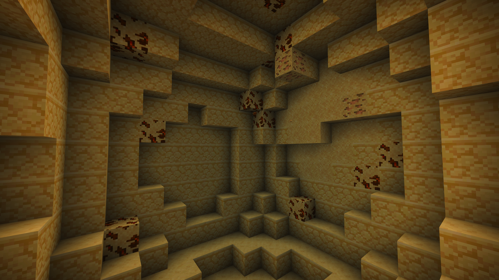
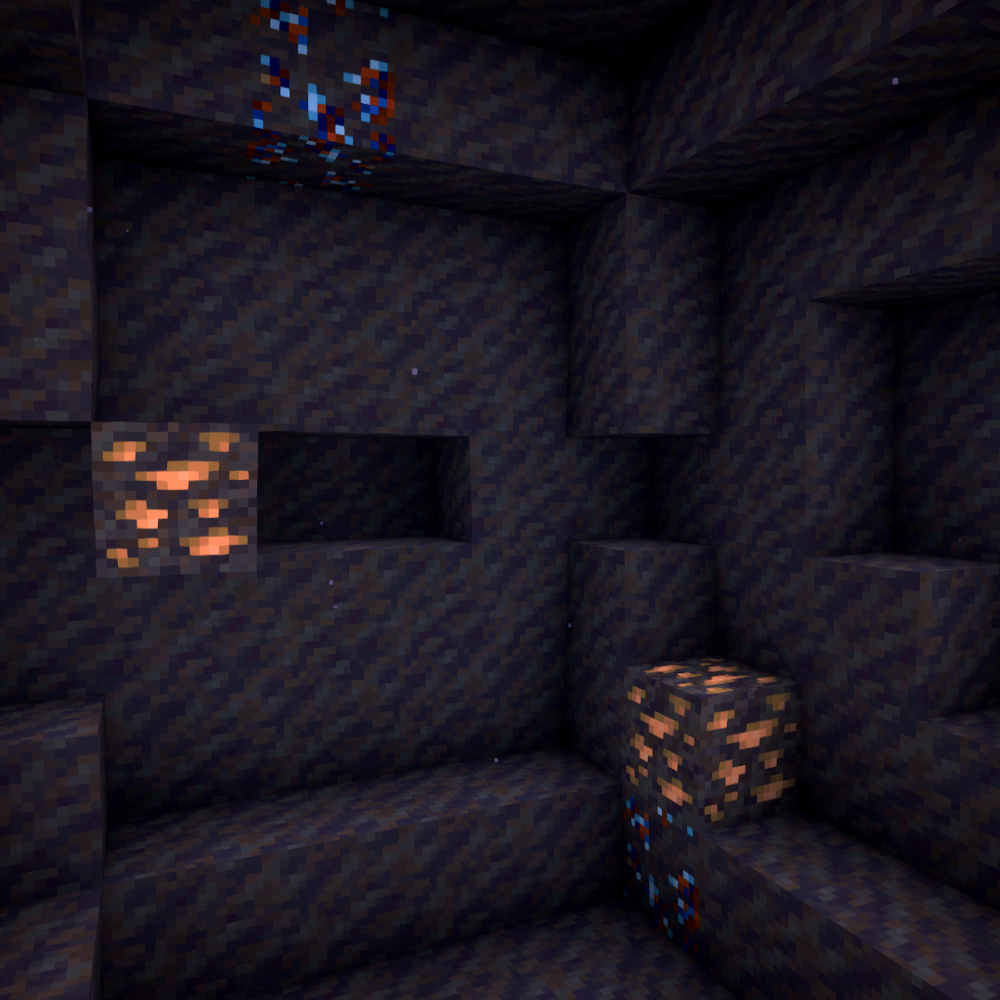
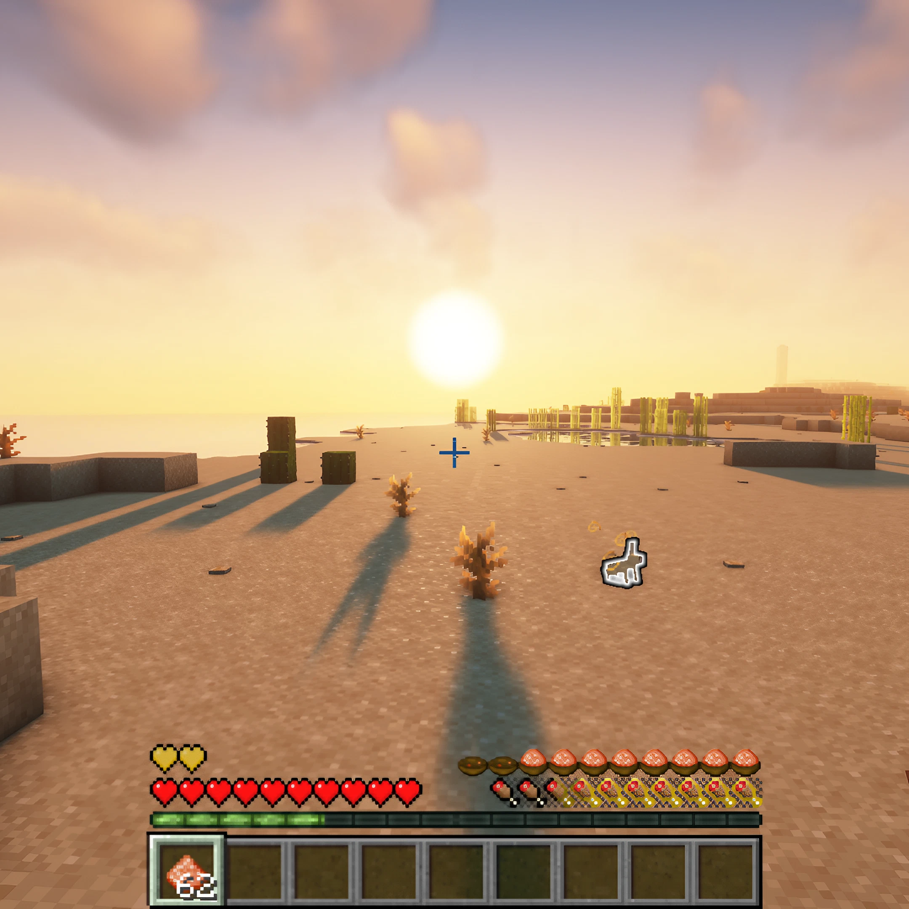

This is a Minecraft mod inspired by the book Dune. The mod focuses on harvesting and processing Spice. 
**Supports**: 1.19.2

Release to CurseForge Coming Soon...

## Details
In game advancements will walk you through the harvesting and production of spice.

Enriched sand and mud spawn in geodes in desert biomes along with two new iron ore variations.

Unrefined Spice can be made into Spice using a blast furnace

### Addiction
There is a chance of becoming addicted when consuming spice, if you do not consume spice this will worsen and lead to increasingly bad effects.
- Nasuea
- Blindness
- Death

### Benifitial Effects
- Regeneration
- Absorbtion
- Focus - This applies glowing to nearby entities

### Language Support
- English
- Thai

Language contributions are welcome

## Future Plans
### Untested
- Server support

### This Mod
- Dynamic Addiction (Get more or less addicted based on how much you take)
- Blue vision and prescience visions at higher addiction levels
- Addiction and spice effects from sand storms and food when in the desert
- Update to 1.20
- More Create support (Currently washing can be used to automate spice production)
- No backporting planned

### Other Mods
- Arrakis Desert for a more baron and dry style desert
- Vehicles form the book
- Animals from the book
- Still Suits

### Modpack
Plans to include in a Hardcore Desert Modpack inspired by Dune that's currently in development including but not limited to
- Tough as Nails
- Create
- Farmer's Delight
- JEI
- Assortment of YUNG's mods
- ...Many more

There are also plans for other Dune inspired mods and integrations
